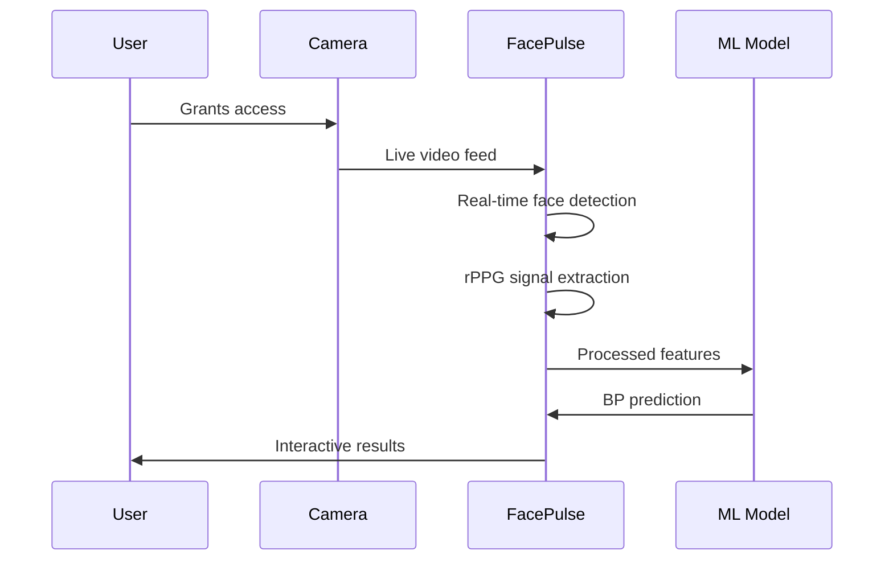
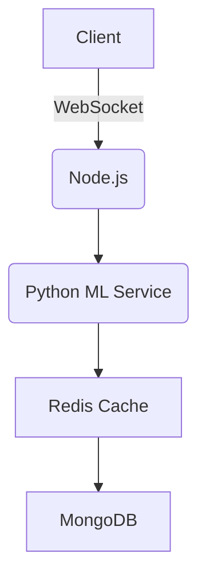

# BP Estimation via face-recognition using rPPG

# FacePulse: Smart Blood Pressure Prediction System


## 🌟 Revolutionizing Health Monitoring Through Facial Analysis

FacePulse is an innovative AI-powered web application that estimates blood pressure non-invasively using just your device's camera. Our cutting-edge technology combines computer vision and machine learning to provide convenient health insights without traditional measurement tools.



## 🚀 Key Features Showcase

### Real-Time Face Analysis

)
- Precise facial landmark detection
- Forehead ROI tracking for rPPG
- Emotion recognition

### Blood Pressure Simulation
```python
# Sample rPPG processing (simplified)
def extract_rppg_signal(video_frames):
    forehead_roi = detect_forehead(facial_landmarks)
    green_channel = []
    for frame in video_frames:
        roi = extract_roi(frame, forehead_roi)
        green_channel.append(np.mean(roi[:,:,1]))  # Green channel intensity
    return bandpass_filter(green_channel)
```

### Interactive Results Dashboard

- Visual BP classification
- Trend analysis over time
- Personalized health recommendations

## 📊 Detailed System Workflow

1. **Face Detection Phase**
   - Haar cascades initialize face detection
   - 68-point facial landmarks pinpoint forehead region

2. **rPPG Signal Processing**
   ```mermaid
   graph LR
       A[Raw Video] --> B[Face Detection]
       B --> C[Forehead ROI Extraction]
       C --> D[Green Channel Analysis]
       D --> E[Bandpass Filtering]
       E --> F[Peak Detection]
   ```

3. **Machine Learning Prediction**
   - 11 key features extracted from rPPG signal
   - Random Forest model predicts systolic/diastolic BP
   - Confidence scoring for result reliability

## 🏆 Comparative Performance

| Metric | FacePulse | Traditional Methods |
|--------|-----------|---------------------|
| Measurement Time | 30-45 sec | 1-2 min |
| Comfort | Non-invasive | Cuff pressure |
| Portability | Any smartphone | Specialized device |
| Accuracy* | ±8 mmHg | ±3 mmHg |

*Compared to clinical sphygmomanometers

## 🛠️ Technical Implementation Deep Dive

### Backend Architecture


### Feature Extraction Pipeline
```python
# Complete feature extraction example
def extract_features(signal, fs=30):
    features = {}
    # Time-domain
    features['mean_amp'] = np.mean(signal)
    features['std_amp'] = np.std(signal)
    
    # Frequency-domain
    f, Pxx = welch(signal, fs=fs)
    features['dominant_freq'] = f[np.argmax(Pxx)]
    
    # HRV metrics
    peaks, _ = find_peaks(signal)
    features['hrv_rmssd'] = calculate_rmssd(peaks)
    
    return features
```

## 📱 Mobile Responsiveness


- Optimized for all screen sizes
- Progressive Web App capabilities
- Offline functionality for repeat users

## 🔮 Future Roadmap

- Integration with health APIs (Apple Health, Google Fit)
- Multi-user profiles with historical tracking
- Advanced hypertension risk scoring
- Clinical validation studies

## 🚨 Important Medical Disclaimer

```diff
- FacePulse provides ESTIMATES only
- Not a replacement for medical devices
- Consult healthcare professionals for diagnosis
- Designed for wellness tracking, not clinical use
```

---

<p align="center">
  <a href="https://your-demo-link.com">Live Demo</a> | 
  <a href="https://github.com/yourrepo">GitHub Repo</a> | 
  <a href="mailto:contact@facepulse.com">Contact Us</a>
</p>

<p align="center">
  
</p>
